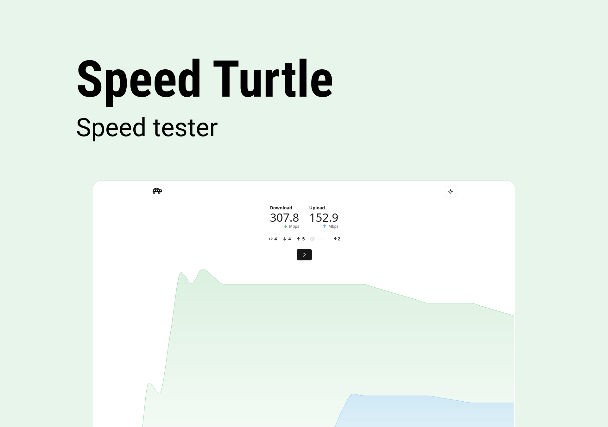

<p align="center">

  <h1 align="center" id="project_name">Speed Turtle</h1>
  <p align="center">
    
    
    
  </p>
</p>

Track your internet speed effortlessly with real-time insights and interactive visuals.



## 💻 About the Project

Speed Turtle is a modern and intuitive tool for testing internet speeds. Designed to simplify the analysis of download and upload data, the application provides dynamic, interactive graphs that enable real-time monitoring of speed fluctuations with ease and clarity.

## 🛠 Technologies

The following tools were used to build the project:

- **[React](https://reactjs.org/)**
- **[TypeScript](https://www.typescriptlang.org/)**
- **[Vite](https://vite.dev/)**
- **[Tailwindcss](https://tailwindcss.com/)**
- **[Shadcn](https://ui.shadcn.com/)**

> See the file [package.json](https://github.com/erik-albuquerque/speed-turtle/package.json)

### Utilities

- Lib: **[@cloudflare/speedtest](https://www.npmjs.com/package/@cloudflare/speedtest)**
- Editor: **[Visual Studio Code](https://code.visualstudio.com/)**
- Icons: **[Lucide icons](https://lucide.dev/)**

## 💿 How to Run

### 🧰 Prerequisites

Before you begin, you will need to have the following tools installed on your machine:

> [Git](https://git-scm.com), [Node.js](https://nodejs.org/en/) or [Yarn](https://yarnpkg.com/) if that's your preference. Additionally, it's good to have an editor to work with the code, such as [VSCode](https://code.visualstudio.com/)

### 🧭 Running the Project

```bash
# Clone this repository
$ git clone https://github.com/erik-albuquerque/speed-turtle

# Navigate to the project folder in terminal/cmd
$ cd speed-turtle

# Install dependencies (npm or yarn)
$ npm install

# Run the application in development mode
$ npm run dev

# Access http://localhost:5173/
```

## 🧪 Demo

<a href="https://speed-turtle.vercel.app/">
  
</a>

## 🙋‍♂️ Become a Contributor

Want to be a part of this project? Click [HERE](CONTRIBUTING.md) and read how to contribute.

## 🦸 Author


Érik Albuquerque

[](https://www.linkedin.com/in/erik-albuquerque/)[](mailto:erik.albuquerque.oficial@gmail.com)

## 📝 License

Distributed under the MIT License. See the [LICENSE](LICENSE) for more information.

Made with ❤️ by Érik Albuquerque 👋🏽 [Get in touch!](https://www.linkedin.com/in/erik-albuquerque/)

[⬆ Back to top](#project_name)
